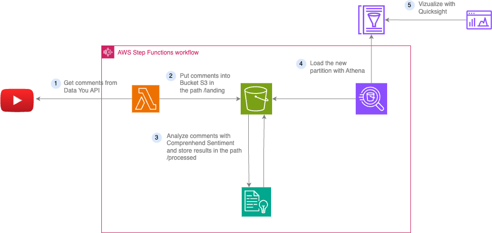

<div align="center">
    <h1 align="center">
        YouTube Comments Analysis<br>
        <em style="font-size: 18px;color:grey">with</em>
        <em style="font-size: 22px;color:grey">AWS Serverless Services</em>
    </h1>
</div>

## Requirements

- **AWS Account**: This project utilizes AWS as its Cloud Provider. Hence, having an AWS account is essential for deploying and testing the project.
- **Poetry**: Poetry serves as the tool for managing Python dependencies used by Lambda functions. To install it, refer to the [Poetry Installation Guide](https://python-poetry.org/docs/#installation).
- **Terraform**: Terraform is employed for infrastructure as code. To install it, follow the instructions provided in the [Terraform Installation Guide](https://developer.hashicorp.com/terraform/install).

## Architecture



**Note**: The YouTube API key is stored as a secret in AWS Secret Manager and is retrieved directly within the Lambda function. Refer to the [Lambda code](lambda_function/src/lambda_function.py) for more details.

## Deploy project in AWS

### 1. Obtain Your YouTube API Key

Follow the steps outlined in the official documentation to acquire your YouTube API key: [YouTube Data API Overview](https://developers.google.com/youtube/v3/getting-started)

### 2. Create a Secret in AWS

After obtaining your API Key, store it as a secret in AWS Secret Manager:

1. Navigate to: [AWS Secret Manager Console](https://eu-west-1.console.aws.amazon.com/secretsmanager/listsecrets?region=eu-west-1).
2. Click on "Store new secret" and select "Other type of secret".
3. Enter the value of your API Key in **Plaintext** format. Configure other options as per your requirements and save the secret.

### 3. Configurer le secret dans terraform

Update the `variables.tfvars` file, replacing the value of the variable `youtube_api_key_secret_name` with the name of the secret you created earlier.

### 4. Deploy project

```bash
terraform init
terraform apply
```

**Warning**: If you modify the AWS region in `main.tf`, ensure that AWS Comprehend is available in your selected region. You can verify this on the [AWS Regional Product Services page](https://aws.amazon.com/fr/about-aws/global-infrastructure/regional-product-services/).

## Main Tools Used in This Project

- [Terraform](https://www.terraform.io/): Infrastructure as code tool for managing resources.
- [AWS](https://aws.amazon.com/): Cloud provider offering various serverless services.

The AWS services used in this project are:

- [Step Functions](https://aws.amazon.com/step-functions/): Orchestration service for coordinating the execution of multiple AWS services.
- [Lambda function](https://aws.amazon.com/lambda/): Compute service to execute code for fetching YouTube comments.
- [S3](https://aws.amazon.com/s3/): Object storage service used for storing comments.
- [Comprehend](https://aws.amazon.com/comprehend): Natural Language Processing (NLP) service for analyzing comments.
- [Glue Catalog](https://aws.amazon.com/glue/): Metadata store to manage and keep track of comments.
- [Athena](https://aws.amazon.com/athena/): Service for analyzing data stored in Amazon S3 using standard SQL queries.
- [Secret Manager](https://aws.amazon.com/secrets-manager/): Securely store and manage the YouTube API key.
